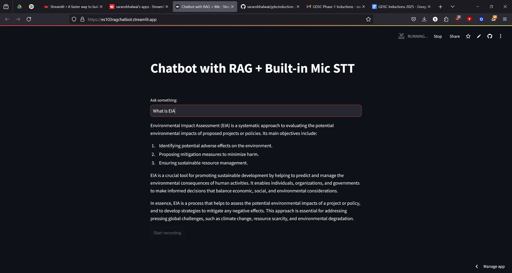

# Chatbot with RAG + Mic

Welcome to the Chatbot with RAG + Mic project! This project demonstrates how to build a chatbot using Retrieval-Augmented Generation (RAG) and includes a built-in microphone for speech-to-text (STT) functionality.

## Getting Started

To get started with this project, follow these steps:

1. **Clone the repository**:
    ```bash
    git clone https://github.com/saranshhalwai/gdscinduction.git
    ```
2. **Navigate to the project directory**:
    ```bash
    cd gdscinduction
    ```
3. **Install dependencies**:
    ```bash
    pip install -r requirements.txt
    ```

## Project Structure

- `app.py`: Contains the main code for the chatbot with RAG and mic functionality.
- `requirements.txt`: Lists the dependencies required for the project.
- `ES103.docx`: notes given to the RAG chatbot.

## How It Works

1. **Document Processing**:
    - Loads a `.docx` file and processes its content.
    - Splits the document into chunks using `RecursiveCharacterTextSplitter`.
    - Converts the chunks into embeddings using `HuggingFaceEmbeddings` and stores them in a FAISS index.

2. **Chatbot Functionality**:
    - Uses the FAISS index to retrieve relevant document chunks based on user queries.
    - Generates responses using the Groq API with the retrieved context.

3. **Speech-to-Text (STT)**:
    - Uses the Whisper model to transcribe audio input from the microphone.

4. **Text-to-Speech (TTS)**:
    - Converts the chatbot's text responses into speech using the TTS API.

## Running the Application

To run the application, use the following command:
```bash
streamlit run app.py
```

## License

This project is licensed under the MIT License. See the [LICENSE](LICENSE.md) file for details.

## Contact

If you have any questions, feel free to reach out to us at [saransh2304@gmail.com](mailto:saransh2304@gmail.com).

Happy coding!
